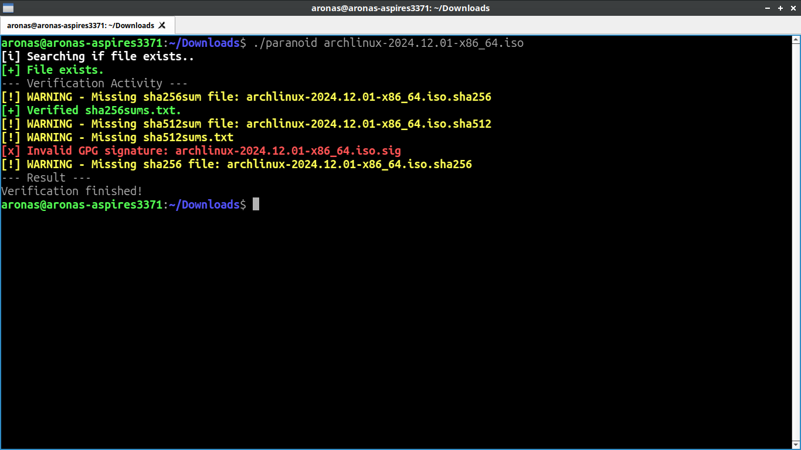

# paranoid
A program that verifies your files. Read our man page for more info.

## Installation
1. Download your Makefile.
2. In the directory of your Makefile, run `make help` or `make`.
3. Follow their own steps.
4. Enjoy!
